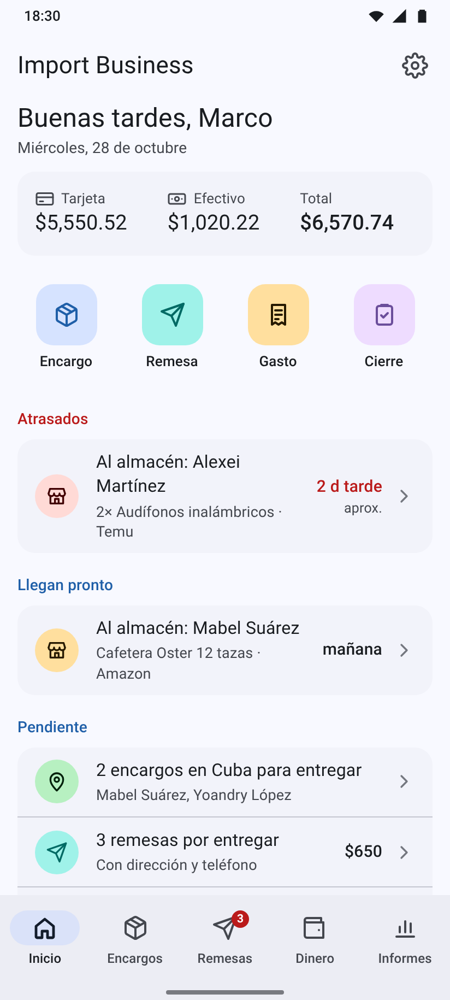
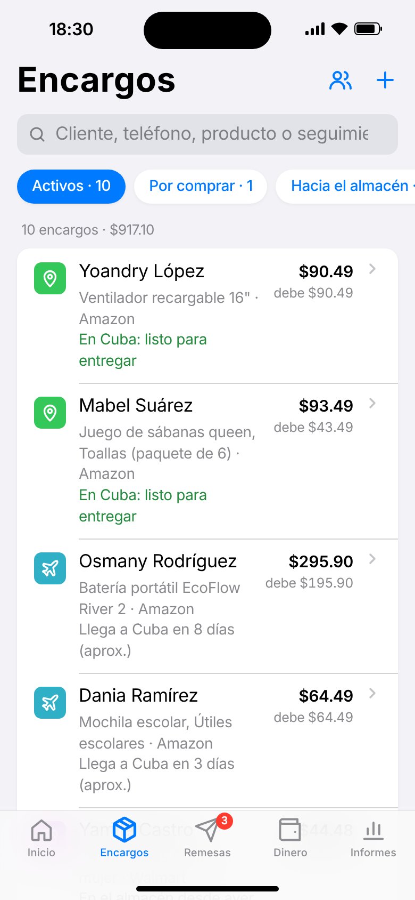
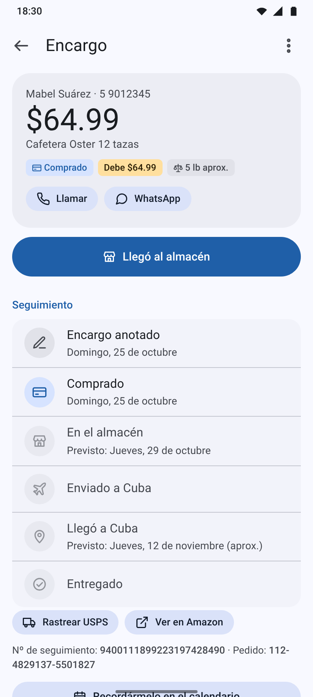
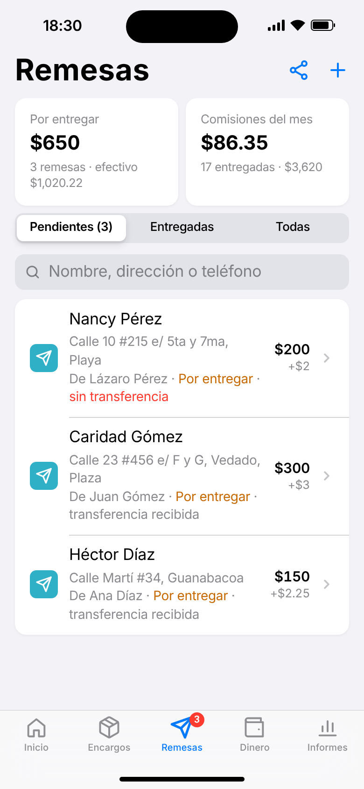
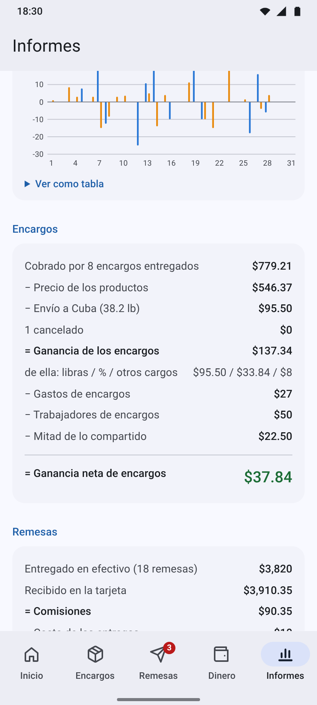

# Import Business

Web app para el negocio de **encargos de compras por internet con envío a Cuba** y de **remesas**: cada encargo desde la compra hasta la entrega (con su precio por libras), el dinero de la **tarjeta en EE. UU.** y del **efectivo en Cuba**, gastos, pagos a trabajadores, la **ganancia de cada negocio por separado** y el **cierre del día**.

- 📱 **Se adapta al teléfono**: estilo iOS en iPhone y Material Design en Android (claro y oscuro). Se puede forzar uno en Ajustes.
- ✈️ Se instala en la pantalla de inicio y funciona **sin internet**.
- 🔄 **Sincronización entre teléfonos (beta, opcional)**, cifrada, con copia de seguridad automática antes de traer datos nuevos.
- 🔒 Los datos se guardan en cada teléfono, no en este repositorio.

**App:** https://marcoh03.github.io/Import_business_app/
**Manual de uso (Android y iPhone):** [manual/Manual-Import-Business.pdf](manual/Manual-Import-Business.pdf)
**Capturas:** [`preview/android/`](preview/android/) y [`preview/ios/`](preview/ios/)

| Inicio (Android) | Encargos (iPhone) | Encargo (Android) | Remesas (iPhone) | Informes (Android) |
|---|---|---|---|---|
|  |  |  |  |  |

## Funciones

- **Encargos**: cliente (nombre y teléfono), productos con el precio pagado, tienda (Amazon, SHEIN, Temu…), nº de pedido y de seguimiento, peso y estado: *por comprar → comprado → en el almacén → enviado a Cuba → en Cuba → entregado* (o cancelado, con devolución). Línea de tiempo con las fechas y los **días de cada tramo** (compra → almacén → Cuba).
- **Precio**: productos + libras × cobro por libra + **% del producto (apagado por defecto)** + otros cargos o descuentos; precio acordado opcional, libras completas y redondeo. Ganancia = precio − productos − libras × costo de la libra. Cada encargo guarda sus precios.
- **Llegadas y avisos**: fecha prevista al almacén (escrita, **pegada del texto de la tienda** o calculada con lo que tarda cada tienda, aprendido con los encargos reales) y a Cuba. Inicio muestra lo que llega pronto y lo atrasado; avisos del teléfono (opcionales) y **recordatorio en el calendario**. Botones para **rastrear** el paquete (UPS, USPS, FedEx, DHL, Amazon o 17TRACK) y abrir el pedido en la tienda.
- **Cobros**: adelantos y pagos en efectivo o tarjeta, lo que debe cada cliente, cobro al entregar. Enviar varios encargos del almacén a Cuba de una vez. Lista de **clientes** con su historial.
- **Remesas**: transferencia a la tarjeta con un % por encima → efectivo entregado en Cuba. Pendientes con **nombre, dirección y teléfono** (llamar, WhatsApp, mapa), cálculo en los dos sentidos, costo de la entrega, aviso si el efectivo no alcanza y lista para compartir con el mensajero. Se registra como cambio de efectivo a tarjeta.
- **Dinero**: saldos de tarjeta y efectivo calculados con todo lo anotado; añadir, retirar, pasar entre cuentas y contar. **Gastos** por categoría y por negocio (encargos, remesas o los dos a medias) y **trabajadores** con sus pagos.
- **Informes** por día, semana, mes o año: ganancia neta total y de **encargos** y **remesas** por separado, dinero que entró en tarjeta y en efectivo, gráfico, tiempos de llegada por tienda y gastos por tipo.
- **Cierre del día**: ganancia de cada negocio, ingresos, lo que pasó, efectivo esperado contra contado, saldo de la tarjeta y **lo pendiente** (por llegar al almacén y a Cuba, por entregar, por cobrar). Se guarda y se comparte por WhatsApp.
- **Copias de seguridad**: automáticas en el teléfono (antes de sincronizar, combinar o restaurar) y en archivo para Drive/WhatsApp.

## Sincronización (beta)

Opcional, se activa en **Ajustes → Sincronizar entre teléfonos**. Una persona crea el grupo con un *token* de GitHub que solo tiene permiso de Gists; la app genera un **código de grupo** (`IB1-…`) que los demás pegan para unirse.

- Cada cambio se marca con su hora y autor; al sincronizar, de cada registro gana la versión más reciente y los borrados se respetan (también los ajustes, uno por uno).
- **Antes de aplicar datos de otros teléfonos se guarda una copia de seguridad** del teléfono, que se puede restaurar desde *Copias automáticas*.
- Los datos compartidos se guardan en un **Gist secreto cifrado con AES-256-GCM**; la clave solo está en el código del grupo. GitHub guarda el historial de versiones.
- Sin internet: «Enviar mis datos» / «Combinar datos recibidos» por archivo, con la misma fusión.

## Publicar con GitHub Pages (una sola vez)

1. Fusiona esta rama en `main`.
2. En GitHub: **Settings → Pages → Build and deployment → Source: Deploy from a branch**, rama `main`, carpeta `/ (root)` → **Save**.
3. En un par de minutos la app estará en `https://marcoh03.github.io/Import_business_app/`.

El archivo `.nojekyll` hace que GitHub sirva los archivos tal cual. El repositorio solo contiene el código y datos de ejemplo inventados (en las capturas).

## Instalar en el teléfono

- **Android**: abre la dirección en **Chrome** → **Instalar aplicación** (o menú ⋮ → *Instalar aplicación*).
- **iPhone**: abre la dirección en **Safari** → **Compartir** → **Añadir a pantalla de inicio**.

## Estructura

```
index.html              Página principal (PWA); elige el diseño iOS o Android antes de pintar
manifest.webmanifest    Datos para instalarla (icono, colores, capturas)
sw.js                   Service worker: uso sin internet y avisos de llegada con la app cerrada (Android)
css/app.css             Material Design 3 + capa de estilo iOS (html.ios)
js/store.js             Datos (IndexedDB) y cálculos: precios, llegadas, dinero, estadísticas, cierre, seguimiento
js/sync.js              Sincronización: cambios, fusión, copias automáticas, cifrado y GitHub Gist
js/ui.js                Componentes que se adaptan a iOS/Android: pantallas, hojas, diálogos, gestos
js/core.js              Guardado, refresco y compartir
js/app.js               Pestañas (Inicio, Encargos, Remesas, Dinero, Informes) y arranque
js/orders.js            Encargos, estados, cobros, seguimiento y clientes
js/remit.js             Remesas
js/money.js             Cuentas, gastos, trabajadores y movimientos
js/closure.js           Cierre del día y su texto
js/settings.js          Ajustes, bienvenida, copias, avisos, instalación y pantallas de sincronización
icons/ manual/ preview/ Iconos, manual en PDF y capturas (android/ e ios/)
tools/                  Iconos, capturas, manual y pruebas
```

## Desarrollo

No hace falta compilar nada. Para probar en local:

```bash
npx http-server -p 8080 -c-1 .
# http://localhost:8080/?ui=ios  o  ?ui=android  para ver un diseño concreto
```

Al publicar cambios, **sube la versión** de `VERSION` en `sw.js` (y `APP_VERSION` en `js/store.js`) para que los teléfonos descarguen la nueva; la app mostrará «Hay una nueva versión».

Pruebas y regenerar capturas y manual (con el servidor local en marcha):

```bash
node tools/test-logic.mjs                                   # cálculos, fusión y cifrado
node tools/mock-gist-server.cjs 8090 &                      # Gist falso para probar la sincronización
NODE_PATH=$(npm root -g) node tools/test-sync.cjs           # dos teléfonos sincronizando
NODE_PATH=$(npm root -g) node tools/make-icons.cjs
DARK=1 NODE_PATH=$(npm root -g) node tools/screenshots.cjs  # capturas Android e iPhone, claro y oscuro
NODE_PATH=$(npm root -g) node tools/make-manual.cjs
```
